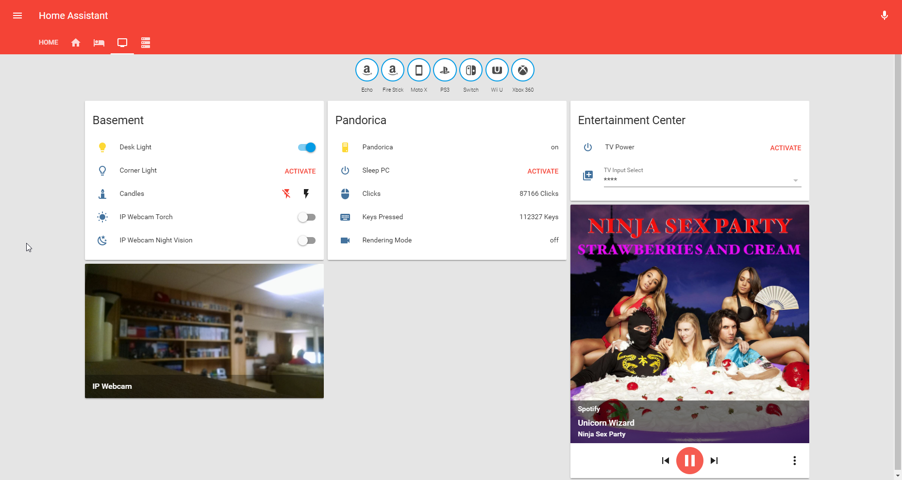

# Home Assistant Configuration
I have no idea what I'm doing. Sorry if this is poorly documented.

# My Devices
* An old Computer running Ubuntu Mate
* Raspberry Pi (Controls Garage)
* Moto X 2013 (Used as Webcam/Tasker Server)
* Dash Button x2
* Echo Dot
* Dash Wand
* Broadlink RM3
* Yeelight RGB Bulb
* TP-Link Smart Bulb
* TP-Link Smart Switch
* Sonoff Switch (Stock Firmware for now)
* Linear HUSBZB-1 (Zigbee Home Automation/Zigbee)
  * Sengled Element Classic Bulb x2
  * Sengled Element Touch Bulb
  * Visonic Window/Door Sensor - MCT-340 E x4

# Software
The configuration also makes use of these programs or custom components:
- [HA Custom UI](https://github.com/andrey-git/home-assistant-custom-ui)
- [MinecraftServer-HA] (https://github.com/GreenTurtwig/MinecraftServer-HA)

# Screenshots
Updated July 21st. Red theme activates when alarm is on.

# Dream list:
- [ ] Check if PC is rendering a video before sleep
- [ ] Garage Tilt Sensor, with 'Open' Light
- [ ] Control Overhead Basement lights
- [ ] LED Strip for Amiibo Display
- [ ] Litterbox Notification via weight

# Contact
If you have any questions about Home Assistant, there are much better avenues. If you have questions 
specifically about this configuration, contact me on Twitter, or most places with the same username.  @vidvisionify